# She Rocks!


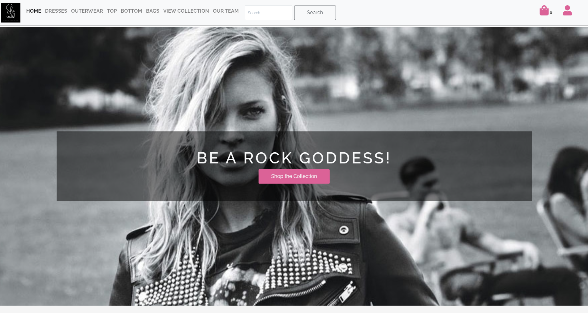

For the fourth Milestone Project, I decided to combine two of my passions, fashion and rock music, 
in an e-commerce website. Having a background in high-end retail, I decided to keep the same customer target, 
but specializing in rock chic style clothing.

View the live project here. [She Rocks](https://sherocks.herokuapp.com/)

If you want to test the functionality, you can use those details:

* Username: testwebsite

* Password: thisisapassword

* Email: test@test.it

Payment simulation:

* Card: 4242 4242 4242 4242 (U.S.A.)

* Date: any date in the future

* CVC/ZIP: any integers


### :page_with_curl: Navigation Menu

The navigation menu sticks to the top of every page. 

In this way, a user can navigate easily even if he/she scrolls down the page.

This is how it looks on larger devices:

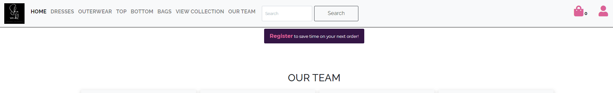

On smaller screens the navbar collapses into a hamburger icon:

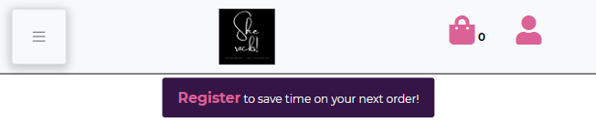

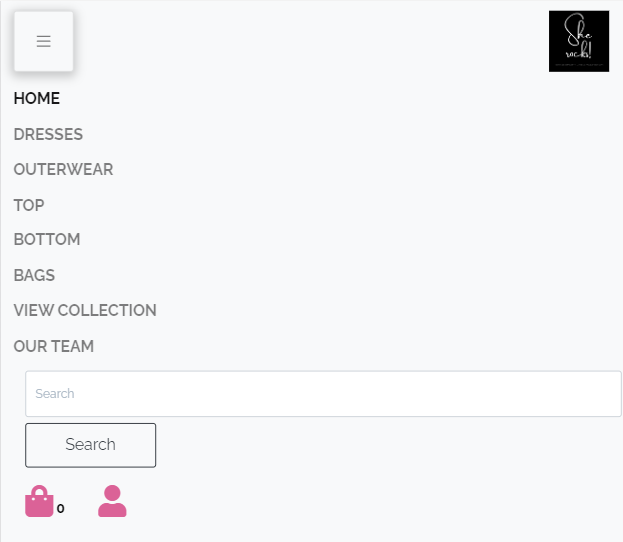

### :page_with_curl: Footer

The footer has a black background,
so that it marks a clear distinction with the rest of the body and visually close the space.

The area is divided into three sections, that on larger screens are one next to the other,
but on smaller screens are displayed vertically.

The first column is a brief summary of the menu with a list of the products pages.
There is also a mention about safe payments with Stripe, because I think that in a e-commerce
website is important to give clear information about payments.

The second column is the "Connect" section: we have the Social Media links, but also a link
to the Team page. Again, it is important to show the customer who is behind a virtual website.

The third column is about the Company info: name, address, CRN, phone and email.

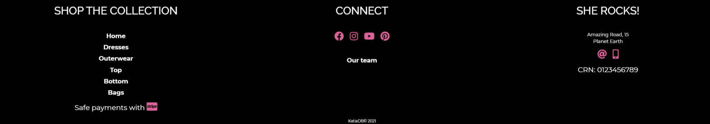


### :page_with_curl: Home Page

The home page is divided into four sections.

The first one welcomes the user with a background image of a model dressed in a rock style,
 who personifies the target customer and serves to create an immediate visual and mental connection 
 between the user and the company.
An overlay with text ("Be a rock goddess") gives an input to buy, leveraging the target customers unconscious.
This first div has a parallax effect (obtained with JavaScript).

I wanted it to be incisive, direct and appealing. One of the first things I learned working in stores with highly 
demanding customers is that the first 5 seconds in which the customer enters the store already determines his willingness to buy.

Scrolling down the page, there is a second section with a quote by Coco Chanel "I don't do fashion. I am fashion", which
serves to empower again the feeling of strenght and uniqueness in the potential customer, flanked by a picture of the last item 
added in the store. This whole block is visible only on larger screens; on smaller devices the user can see only the picture and 
not the quote. I decided to leave only one of the two because I didn't want the home page to be too long: it should arouse interest,
not annoy.

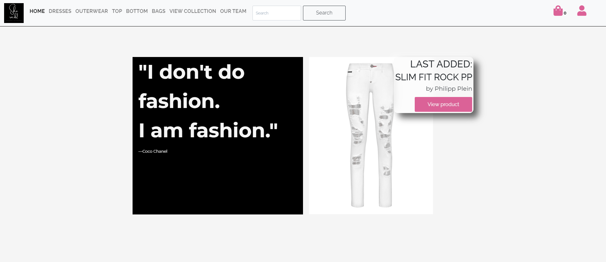

The third section is similar to the first one: there is again a background image with a model dressed in rock style, but the
text in the overlay now invites the user to register. 
There is again a parallax effect, but this time obtained with pure CSS.
I had to add some JavaScript to fix a bug on iOS, since the fixed background is not supported. Users from a iOS device can't see
the parallax effect on this third section, but it does not affect the User Experience.

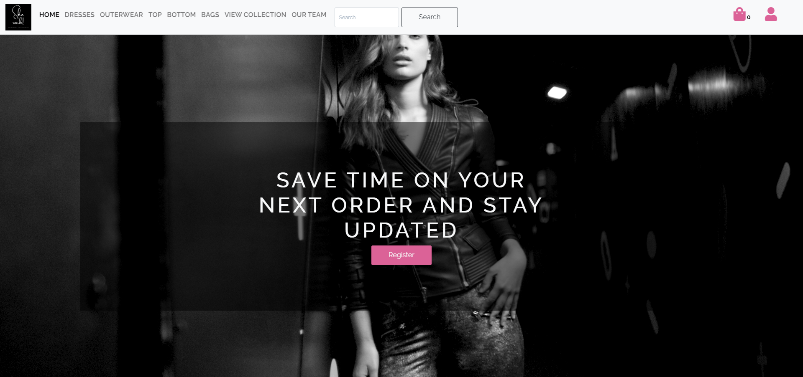

The last section is a carousel with random images taken from the products database. The images change everytime the user refreshes
the page, so the content is always dynamic.

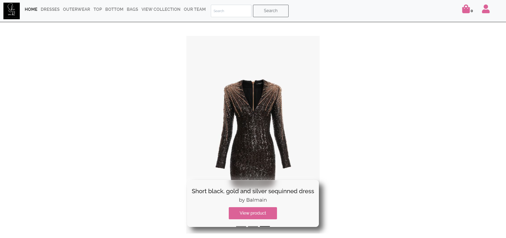


### :page_with_curl: Collection

The collection page is simple. It returns all the products in the database, and for each product there is a card with image, name, brand and price.

It is possible to sort the products by price, brand name and product name.

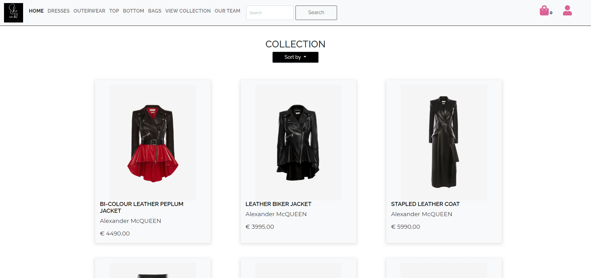

### :page_with_curl: Search Functionality

From the navbar it is possible to search for a specific word in the database.

The results are displayed with the same layout of the collection page, but there is a extra banner with the text that the user
enterd in the search box.

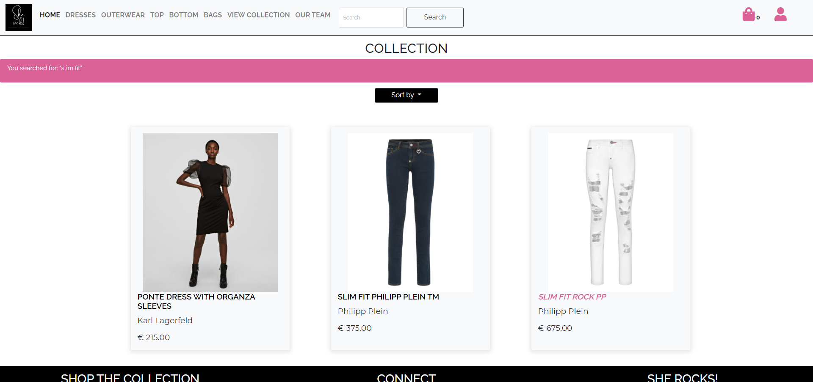

### :page_with_curl: Sort Functionality

The sort functionality is available in all the products pages (collection, category, detail and search).

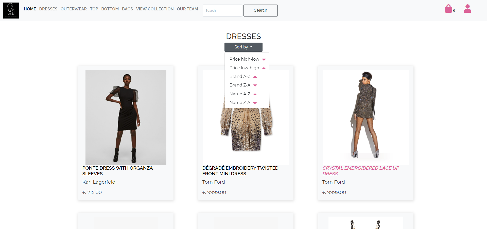

### :page_with_curl: Products by Category

The Category pages have the same layout of the collection page.

The only difference is that the title renders the name of the specific category.


### :page_with_curl: Product Detail

The product detail page has a title that takes the name of the category of the item and the brand (e.g. "Top by Alexander McQueen).

Then there is the image of the product, its name, brand, price, size (if it has sizes), quantity (the user can add more than one item),
and a submit button that send the product in the shopping bag, or a button that takes back to the collection page.

An accordion has three categories: description, material and reviews. The reviews section is visible only if the item has reviews,
otherwise there is only description and material.

At the bottom there is a carousel with random images (the same structure as there is on the home page). I thought it could increase
sales to add some random items just below the "add to bag" area.

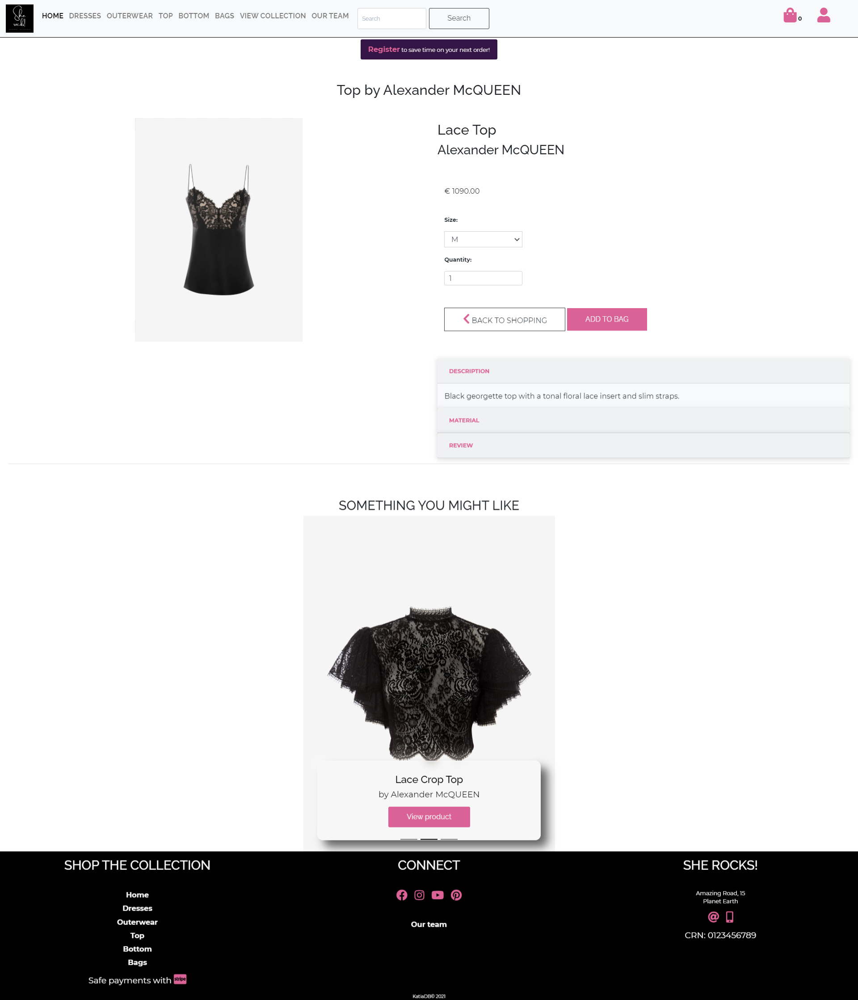

### :page_with_curl: Team

The team page shows all the team members, and for each employee there is the picture, the name, the name of the department,
the role and the contacts (phone number and e-mail).

In this way it is easy for a user to contact the right person, and it also adds thrustworthy because the user can see exactly
who is behind the website.

### :page_with_curl: Login / Register

The login page (but also all the other pages related to allauth functionality) has a background image and a overlay with a 
glassmorphism effect. I choose it because I wanted the website to look modern.

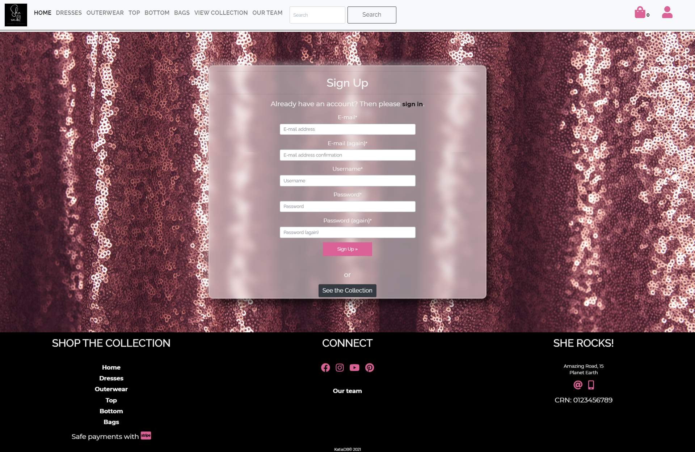


### :page_with_curl: My Profile (only for registered users)

The Profile page is simple. It shows the user delivery information (with the chance to update them), and a section with
the activity of the user on the website.
This section shows the order history and the reviews added by the user.
If the user has no reviews yet, he/she can click on a link that takes to the Review page.

### :page_with_curl: Reviews (only for registered users)

This page has a simple layout and allows the user to add a review to one or more items in the store.

### :page_with_curl: Product Management (only for superusers)

This functionality is limited only to admin. It allows to add a product in the database.

A superuser can also edit or delete products from the collection page, the category pages, the product detail page.

---

## User Experience (UX)


* **:bookmark_tabs: Strategy Plane**

The website is an e-commerce that sells high-end clothing to women that like a rock-chic style.

The company that owns the website wants to show its modern, feminine and strong concept through a visual design and a clear functionality.

The goal is to attract potential customers and increase sales.

A target customer is a woman aged 25-45 that is interested in fashion, has a good economy and likes to spend her money 
on items that makes her feel beautiful. At the same time, she likes an active lifestyle and doesn't like to fit inside classical schemes. 
She has a passion for rock music and she feels independent; she is not afraid to dress sometimes a little bit over the top.

For this reason, the website needs to have a clear structure and a modern design.

Information about the company must be clear, giving also a strong brand identity, and the shopping process needs to be fast and simple.


* **:bookmark_tabs: Scope Plane**

Considering the goal of the website and the target customer, I realized that most of the visits come from mobile phones.

Customers usually shop from their mobile phones while doing something else (e.g. travelling on the subway or just chilling on the sofa),
so the website needs to be mobile first designed.


* **:bookmark_tabs: Structure Plane**

The customer should have the chance to register in order to save personal details and posthumously review the order history or add reviews.

At the same time, there should be the chance to complete an order without registering, for those customers who want only a one-time purchase
 or simply don't want to have a personal profile on the website.

Customers need to search the database by entering specific words in a search box, or by just navigating the website: the menu must
be clear and redirect to the main product categories. It is important also to add a sort button that allows the user to view
the products in a specific order: often users want to list the products by price.

The user needs to constantly monitor the status of the shopping bag without entering the shopping bag page. In this way
he/she knows exactly if is spending too much or if can go on shopping something else.

Admins can access the dashboard by logging in to the /admin path, or simply by logging in from the website as a common user does.
From the dashboard they can perform all the tasks related to orders, customers, products, employees, company details; from the
website pages they can just add new products, edit or delete the ones already on the database.


* **:bookmark_tabs: Skeleton Plane**

The structure of the website is:

* Home Page

* Products by Category

* All Products (Collection)

* Team 

* Register

* Sign In

* My Profile (personal details, order history and reviews)

* Shopping bag

* Checkout page

* Add review

* Product Management (admin)


* **:bookmark_tabs: Surface Plane**

For this project I have looked at different high end fashion websites (e.g. Dior, Chanel, Balmain) to check how those brands communicate
their identity and how they implemented the e-commerce section through design.

A common feature is the simple layout, with a lot of negative space that adds focus on the products, and the predominant use of
black and white colors.

I decided to keep a similar styling throughout the website, but adding some extra "spice" with a splash of color just to make
 the visual impact a little stronger and different (basically how the brand "She Rocks" is).

Call to action buttons are pink, while secondary buttons have a dark background. The size of the buttons is large enough for reliable
 interaction from mobile devices.

A parallax effect in the home page adds a modern touch and a dynamic interaction.

For the register/sign in/sign out page I decided to design a card with glassmorphism effect. According to all UX websites,
this is a trend for the year 2021 (even if it's nothing new because the effect is already known), so I wanted to use it in my project.
To give some tridimensional effect I added some depth using the principles of neumorphism (another trend in UX design).
This is more visible on the overlay in the carousel, that takes the same effect as in the sign in page.

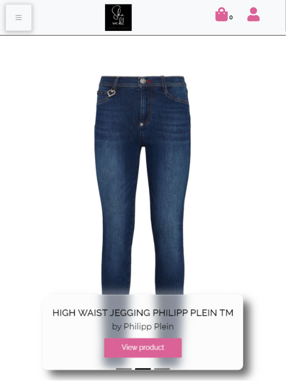

### User stories

#### :computer: Customer stories

|   | Opportunity / Problem / Feature | Importance | Viability |
|---|---------------------------------|------------|-----------|
| 1 | As a customer, I want to navigate the website, so that I understand if I am intersted in buying something. | 5 | 5 |
| 2 | As a customer, I want to check the categories, so that I understand if I am intersted in buying something. | 5 | 4 |
| 3 | As a customer, I want to click on a specific category, so that I understand if I am intersted in buying something. | 5 | 4 |
| 4 | As a customer, I want to see new products, so that I understand if I am intersted in buying something. | 4 | 4 |
| 5 | As a customer, I want to search for a specific term, so that I can find something specific that I want. | 4 | 5 |
| 6 | As a customer, I want to sort products, so that I can see the product list in a specific order. | 4 | 4 |
| 7 | As a customer, I want to click on a specific product, so that I can view its details. | 5 | 4 |
| 8 | As a customer, I want to add a product on my bag, so that I can buy it. | 5 | 4 |
| 9 | As a customer, I want to view my shopping bag, so that I can know how much I am going to spend. | 5 | 4 |
| 10 | As a customer, I want to know how I am going to pay, so that I can feel safe to use my credit card. | 5 | 5 |
| 11| As a customer, I want to know who is behind the website, so that I can feel safe to pay. | 4 | 5 |
| 12 | As a customer, I want to know more about shipment, so that I can feel safe to place an order. | 4 | 3 |
| 13 | As a customer, I want to save my profile, so that I don't have to add all over again with a second purchase | 3 | 5 |
| 14 | As a customer, I want to edit my profile, so that I can update my details | 4 | 5 |
| 15 | As a customer, I want to delete my profile, so that I can delete my details from the database | 3 | 5 |
| 16 | As a customer, I want to add more products to my shopping bag, so that I can buy more than one piece per item | 5 | 4 |
| 17 | As a customer, I want to remove products from my shopping bag, so that I can edit my order | 5 | 4 |
| 18 | As a customer, I want to read reviews for a product, so that I can improve my shopping experience | 4 | 4 |
| 19 | As a customer, I want to write reviews for a product, so that I can share with other users my shopping experience | 4 | 4 |

#### :computer: Admin stories

|   | Opportunity / Problem / Feature | Importance | Viability |
|---|---------------------------------|------------|-----------|
| 1 | As an admin, I want to log in, so that I can access my dashboard | 5 | 5 |
| 2 | As an admin, I want to access my dashboard, so that I can view the tasks I can perform from there | 5 | 5 |
| 3 | As an admin, I want to access my dashboard, so that I can view all the products | 5 | 5 |
| 4 | As an admin, I want to access my dashboard, so that I can add products | 5 | 5 |
| 5 | As an admin, I want to access my dashboard, so that I can edit products | 5 | 5 |
| 6 | As an admin, I want to access my dashboard, so that I can delete products | 5 | 5 |
| 7 | As an admin, I want to access my dashboard, so that I can view all the orders | 5 | 5 |
| 8 | As an admin, I want to access my dashboard, so that I can edit orders | 5 | 5 |
| 9 | As an admin, I want to access my dashboard, so that I can delete orders | 5 | 5 |
| 10 | As an admin, I want to access my dashboard, so that I can view customers details | 5 | 5 |
| 11 | As an admin, I want to access my dashboard, so that I can edit customers details | 5 | 5 |
| 12 | As an admin, I want to access my dashboard, so that I can delete a customer profile | 5 | 5 |
| 13 | As an admin, I want to log in inside the website, so that I can perform tasks from there | 5 | 5 |
| 14 | As an admin, I want to log in inside the website, so that I can edit products from there | 5 | 5 |
| 15 | As an admin, I want to log in inside the website, so that I can delete products from there | 5 | 5 |


As shown from above, the admin stories are extremely important and need to be fully implemented.

The user stories as well are important, but a few will need more time. For instance, it won't be possible in the first release to add
a section about shipments because it means to contact a courier and check with them the terms.

### Design

### Colour Scheme

At the beginning I wanted to stuck with a black/white palette, but then I thought that a splash of colour was suitable, 
as the style of clothing has character and stands out. 

I opted for a deep pink (China Pink) and a dark purple (Russian Violet). I got the inspiration from cyberpunk digital art.

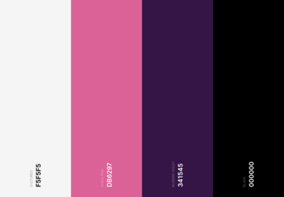


### Typography

I choosed two fonts that are modern and highly legible: Montserrat and Raleway.

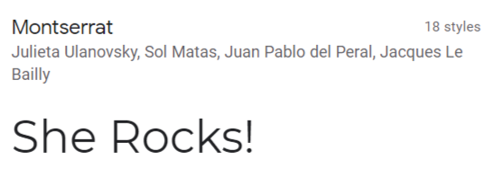
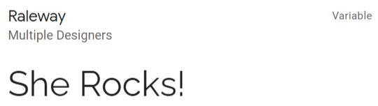


At the beginning I searched for something more out of the ordinary for the titles, but I ended up choosing Raleway.

I didn't want to make the page look too messy and the focus should stay on the pictures.


### Imagery

I got the products images from the brands web pages.

I selected the products that I thought would be perfect in this shop.

The team images has been taken from Unpslash, except for one image that is mine.

The pictures in the home page come from two different websites.

All the links to the images are here: [Images Links](static/readme-doc/Links.pdf)


### Wireframes

You can view my prototypes by clicking on the following links:

* [Mobile Prototype](static/readme-doc/wireframes/mobileEcommerce.pdf)

* [Tablet Prototype](static/readme-doc/wireframes/TabletEcommerce.pdf)

* [Desktop Prototype](static/readme-doc/wireframes/DesktopEcommerce.pdf)

Prototyping has been made with Balsamiq.


### Features

* Responsiveness throughout all devices.

* Navigation Bar always placed at the top of the screen oon all devices. Easy for the user to navigate.

* Brand Logo inside the navbar, always visible, that is also a link to the home page.

* Toasts that display important messages to the user (e.g. Order successfully completed, item added to bag, successfully signed in, etc).

* Shopping bag icon always visible at the top, with the count number of the products inside. Clicking on it, the user is redirected to
 the shopping bag page.

* Profile icon, always visible at the top. Clicking on it, a dropdown appears with sub-links to other pages: "register" and "sign in" for all users,
 "my profile" for registered users and "product management" for superusers.

* Footer always at the bottom of the page, with a summary of the most important links inside the web page, links to social media accounts,
 company information with relative details.

* Links clearly identifiable by a hand pointer cursor and a color change on hover.

* Add to bag buttons from the product detail page that allows to add the item to the shopping bag.

* Size selection for those items that have sizes.

* Quantity (add and subtract) functionality both on product detail page and shopping bag page.

* Secure checkout button that redirects to Stripe for safe payments.


### Features to implement

In the future I will add:

* A section about shipping: how long does it take to have a order shipped and then delivered,
which courier takes care of the parcels, shipping fees, etc.

* Add an icon at the bottom of the viewport that takes the user to the top of the page without having to scroll.

* Functionality in the detail page that allows the user to go back to the exact point he/she was before clicking
on the specific product. Now it takes back to the collection page, but it can be frustrating if a user was
navigating in a specific category and had already scrolled down the page.

* Reviews only for item already purchased. Right now a registered user can add a review for any of the products in store.
 I will limit the functionality to only the products that the user actually purchased. This will avoid fake reviews.

* Chance for a registered user to delete his/her profile directly from the "Profile" area.

* In the confirmation email after placing an order I will include also all the details of the items purchased (name, brand,
price, quantity).

* Chance to log in using social accounts (Facebook, Instagram) and Google.

* Add a section about personal data processing (GDPR) -- very important to do if the website needs to be real!

* Improve the styling inside the "Add review" area. I want to show the image of the product as the user hovers over
 the option names (or click on one of them), because it is not easy to understand which product is just by reading
 at the name. I want also to redirect the user to that specific product page after submitting the review.

* Change styling on toasts messages to make them more similar to overlays on carousel, adding consistency.

* Improve styling on 280px screens (see bug sections)

* Write tests for each app in tests.py.

* Resized images to speed the loading.

* Add pagination.


### Database

For this project I have used SQLite on the local server and Postgres for deployment.

<details>
<summary>Models</summary>

### User Profile
```
class UserProfile(models.Model):
    """
    A user profile model for maintaining default
    delivery information and order history
    """
    user = models.OneToOneField(User, on_delete=models.CASCADE)
    default_phone_number = models.CharField(max_length=20, null=True, blank=True)
    default_street_address1 = models.CharField(max_length=80, null=True, blank=True)
    default_street_address2 = models.CharField(max_length=80, null=True, blank=True)
    default_postcode = models.CharField(max_length=20, null=True, blank=True)
    default_town_or_city = models.CharField(max_length=40, null=True, blank=True)
    default_country = CountryField(blank_label='Country', null=True, blank=True)
    default_county = models.CharField(max_length=80, null=True, blank=True)
```

### Category
```
class Category(models.Model):
    class Meta:
        verbose_name_plural = "Categories"

    name = models.CharField(max_length=30)
    friendly_name = models.CharField(max_length=50, null=True, blank=True)
```

### Product
```
class Product(models.Model):
    category = models.ForeignKey(
        'Category', null=True, blank=True, on_delete=models.SET_NULL)
    sku = models.CharField(max_length=254, null=True, blank=True)
    name = models.CharField(max_length=160)
    brand = models.CharField(max_length=100)
    description = models.TextField()
    has_sizes = models.BooleanField(default=False, null=True, blank=True)
    material = models.CharField(max_length=160)
    price = models.DecimalField(max_digits=6, decimal_places=2)
    image_url = models.URLField(max_length=2000)
    image = models.ImageField(upload_to='products', null=True, blank=True)
```

### Review
```
class Review(models.Model):
    user = models.ForeignKey(UserProfile, on_delete=models.CASCADE, related_name="reviewer")
    product = models.ForeignKey(Product, on_delete=models.CASCADE, related_name="reviewed_item")
    review = models.CharField(max_length=160)
    created = models.DateField(auto_now=True)
```

### Order
```
class Order(models.Model):
    order_number = models.CharField(max_length=32, null=False, editable=False)
    user_profile = models.ForeignKey(
        UserProfile, on_delete=models.SET_NULL,
        null=True, blank=True, related_name="orders")
    full_name = models.CharField(
        default="", max_length=100, null=True, blank=True)
    email = models.EmailField(max_length=254, null=False, blank=False)
    phone_number = models.CharField(max_length=20, null=False, blank=False)
    country = CountryField(blank_label="Country *", null=False, blank=False)
    postcode = models.CharField(
        default="", max_length=20, null=False, blank=False)
    town_or_city = models.CharField(max_length=40, null=False, blank=False)
    street_address1 = models.CharField(max_length=80, null=False, blank=False)
    street_address2 = models.CharField(max_length=80, null=True, blank=True)
    county = models.CharField(max_length=80, null=True, blank=True)
    date = models.DateTimeField(auto_now_add=True)
    delivery_cost = models.DecimalField(
        max_digits=6, decimal_places=2, null=False, default=0)
    order_total = models.DecimalField(
        max_digits=10, decimal_places=2, null=False, default=0)
    grand_total = models.DecimalField(
        max_digits=10, decimal_places=2, null=False, default=0)
    original_bag = models.TextField(null=False, blank=False, default='')
    stripe_pid = models.CharField(
        max_length=254, null=False, blank=False, default='')
```

### Oder Line
```
class OrderLineItem(models.Model):
    order = models.ForeignKey(
        Order, null=False, blank=False, on_delete=models.CASCADE,
        related_name='lineitems')
    product = models.ForeignKey(
        Product, null=False, blank=False, on_delete=models.CASCADE)
    product_size = models.CharField(
        max_length=2, null=True, blank=True)
    quantity = models.IntegerField(null=False, blank=False, default=0)
    lineitem_total = models.DecimalField(
        max_digits=6, decimal_places=2, null=False,
        blank=False, editable=False)
```

### Company
```
class Company(models.Model):
    class Meta:
        verbose_name_plural = "Companies"

    name = models.CharField(max_length=60, null=False, blank=False)
    address = models.CharField(max_length=60, null=False, blank=False)
    phone_number = models.CharField(max_length=20, null=False, blank=False)
```

### Office
```
class Office(models.Model):
    name = models.CharField(max_length=60, null=False, blank=False)
    company = models.ForeignKey(
        'Company', on_delete=models.CASCADE, related_name="office")
```

### Employee
```
class Employee(models.Model):
    full_name = models.CharField(max_length=60, null=False, blank=False)
    email = models.EmailField(max_length=254, null=False, blank=False)
    phone_number = models.CharField(max_length=20, null=False, blank=False)
    office = models.ForeignKey(
        'Office', on_delete=models.CASCADE, related_name="employee_in_office")
    role = models.CharField(max_length=30, null=False, blank=False)
    image = models.ImageField(upload_to='team', null=True, blank=True)
```
</details>

---

## Technologies Used

### Languages Used
* HTML5
* CSS3
* JavaScript
* Python 3.8.6

### Frameworks, Libraries & Programs Used

* Bootstrap 4.5.0.
* Google Fonts
* Font Awesome 4.7.0.
* Git
* GitHub
* GitPod
* Jinja
* pip3
* Django
* Django Crispy Fields
* Django allauth
* Django countries
* Django storages
* Gunicorn
* Pillow
* Psycopg
* Boto3
* Heroku
* SQLite
* Postgres
* [Django Secret Key Generator](https://miniwebtool.com/it/django-secret-key-generator/)
* Stripe
* AWS S3
* Chrome DevTools
* Balsamiq
* Favicon.ico
* Html Validator
* CSS Validator
* JSHint
* Autoprefixer CSS 9.7.6


---

## Testing

<details>

<summary>Functionality Testing </summary>

### Functionality Testing

All the <strong>links</strong> are working.

The <strong>form</strong> validation is handled by Django and it is working.

<strong>HTML</strong> has been validated with [HTML Validator](https://validator.w3.org/) and everything was ok.
Only a warning that the type attribute is unnecessary for JavaScript resources (```<script type="text/javascript">```).

<strong>CSS</strong> has been validated with [CSS Validator](https://jigsaw.w3.org/css-validator/). I get an error that 
the property ```backdrop-filter: blur``` does not exist. I have checked on Stackoverflow and I found that other people
had the same issue. This is caused because the property is not currently supported on all browser (check also the section
Bugs/Solved Bugs/Firefox for more details). The suggestion is to ignore the error.

Other warnings are about CSS vendors prefix. They say that the prefixes are unknown, however they have been added using
Autoprefixer which is a trustable source. Being only warnings, and being vendors important to support browser compatibility,
 I decided to leave them.

<strong>JavaScript</strong> has been checked with [JSHint](https://jshint.com/)

For <strong>Python</strong> I used the command ```python3 -m flake8``` in my terminal to highlight all the issues in my project.
Most of the errors were too long lines and errors DJ01 ("Avoid using null=True on string-based fields").

I checked on Slack some hints on how I should proceed, so I corrected the lenght everywhere 
except in settings.py and I left most of the erorrs DJ01.

I left also 
```
./checkout/webhooks.py:28:5: F841 local variable 'e' is assigned to but never used
./checkout/webhooks.py:31:5: F841 local variable 'e' is assigned to but never used
./checkout/apps.py:8:9: F401 'checkout.signals' imported but unused
```
because they are important for the functionality.

This is how it looks running the flake8 command after I fixed the code:

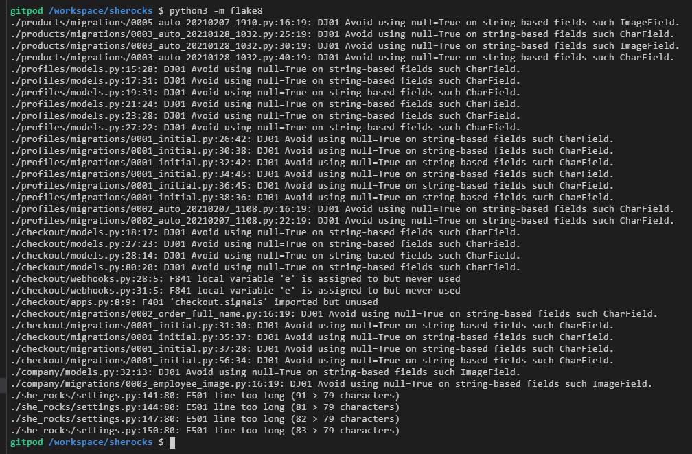

I successfully tested also payments using different credit cards provided by [Stripe](https://stripe.com/docs/testing#international-cards).

I checked that the payment form adapts to the credit card number:

If I enter a card that is in the U.S.A., I get the field for the ZIP code.
    
    Card Number: 4242 4242 4242 4242 | Date: any date in the future | CVC: any number | ZIP Code(example): 24242

If I enter a card that is in the U.K., I get the field for the postal code.
    
    Card Number: 4000 0082 6000 0000 | Date: any date in the future | CVC: any number | Postal Code(example): SW1W 0NY

If I enter a card that is in Australia, I don't get any additional field apart from the credit card details.
    
    Card Number: 4000 0003 6000 0006 | Date: any date in the future | CVC: any number 

I tested the authorization for the payment:

    Card number: 4000 0027 6000 3184

I tested for a invalid CVC:
     
    Card number: 4000 0000 0000 0101

I tested for insufficient founds;

    Card number: 4000 0000 0000 9995

I tested for stolen card:

    Card number: 4000 0000 0000 9979

I tested for expired card:

    Card number: 4000 0000 0000 0069


</details>

<details>
<summary>Usability Testing </summary>

### Usability Testing

Going through the user stories, I tried to test the project with different scenarios on different devices
 (laptop and mobile phone).

#### As a customer

* I want to browse through the categories to understand if there is something I might buy:

    As I open the webiste, I first scroll down to have a look at the home page, then I go back to the top.
    I read the names of the categories in the navigation bar and I click on one of them.

    A page with all the items in that category opens, and I am able to sort the products in different ways (
        price, brand, name
    ).

* I want to add something to my shopping bag:

    When I find an item that I like, I can click on it and I reach the product detail page. Here I can view all
     the details, such as material, sizes, description and reviews.
    There is a button that allows me to add the item to the shopping bag and I can choose the right size and the 
    amount I need. When I add something a toast appears on the top-right of the page, telling me that the item has been
    successfully added.

    I see also that on the top of the page there is a banner with a message, saying how many items I have inside my bag
     and how much is the grand total right now that I should pay if I decide to complete the purchase.

    There is also a count number next to the shopping bag icon inside the navbar.

    At the bottom of the page I can see a carousel with some items that I might like. If I see something interesting,
     I can click on the name of the product and I am redirected to that specific product page. From there, I can 
     repeat the process (add item to the bag, click on another item and visit its page).

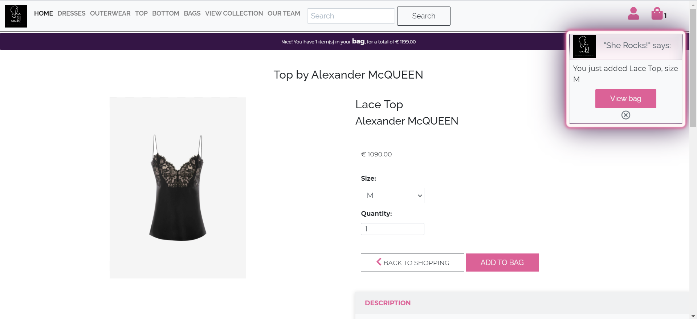

* I want to purchase something:
     I have the chance to access my shopping bag in three ways: from the bag icon in the navbar, from the banner at
      the top of the page clicking on the word "bag" (which stands out from the other words, so I understand it is a link),
      or by clicking the button "View bag" that appears inside the toast when I add a new product.
    
    From my shopping bag, I can review all the items I added and I can also modify it. I can change the quantity per item
     or remove the product. If I decide to update the quantity I see a toast with a message that confirms the updating, 
     but I also can see that the price in the product row changes (it updates automatically), together with the grand total.
    If I remove something, I get as well a toast with a confirmation and the product disapper from the bag. The price updates.

    When I am satisfied with the content in the shopping bag, I can click on the button "Secure Checkout", that brings me 
    to another page.
    Here I find a form where I can enter my details.
    If I am a registered user and I already logged in, I find my info already displayed inside the form. I can leave them
     as they are and go on with the payment, or I can change them.
    A checkout box allows me to save the information for the next time.
    If I am not a registered user, I can complete anyway the purchase. The form in this case is empty and I can fill it 
    with my details.

    I enter my credit card information and the ZIP code if required. If the form is valid, the card is charged and my purchase
     is complete. I am redirected to a page with the summary of my order and a toast confirms the successfully operation.
    In my e-mail account I receive also an email with a brief summary and a contact of the employee repsonsible for the 
    customer service in case I have questions.

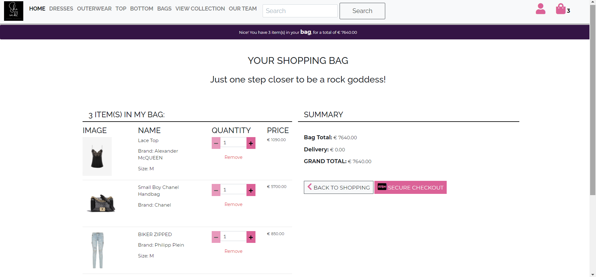

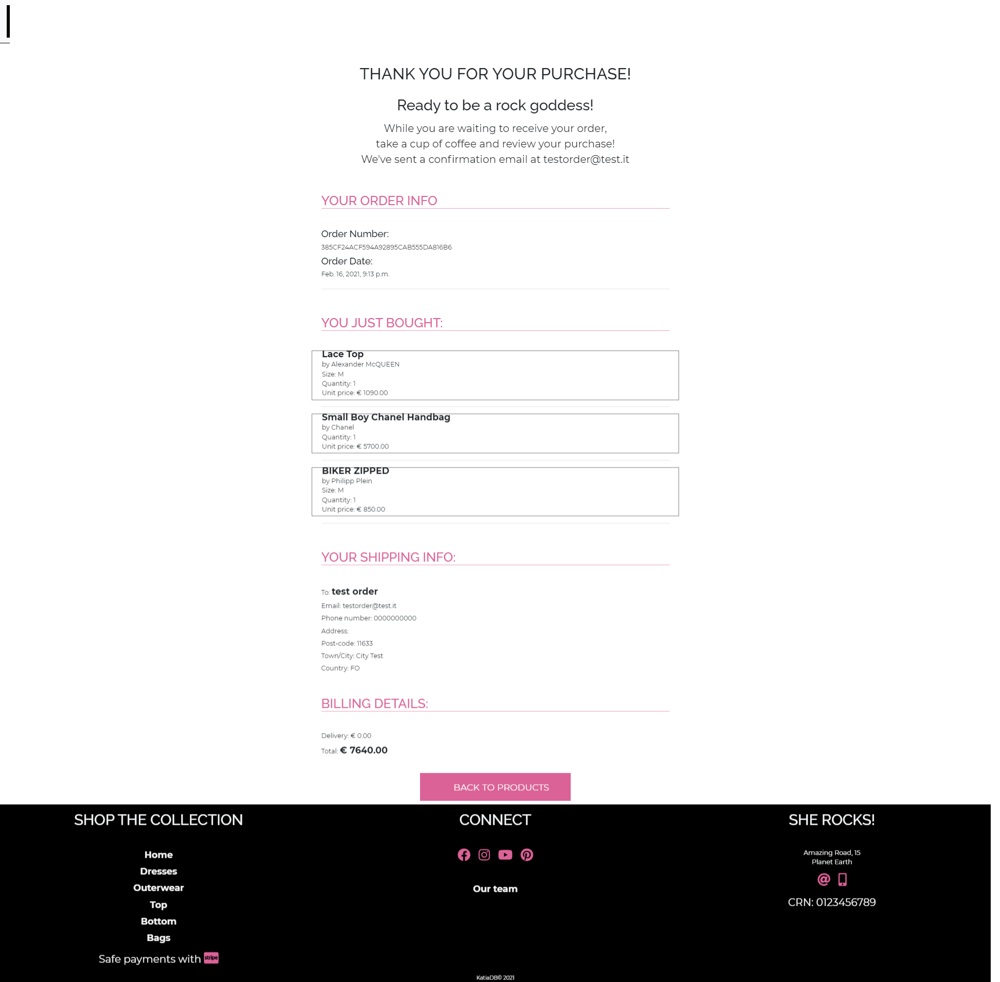

* I want to register:
    
    I click on the profile icon and I see the link to the "Register" page.
    I am redirected to a page with a form where I need to enter my email twice, a username and a password twice.
    If something is wrong in my form (a wrong format) I am not allowed to submit and a message inside the form explains me what
     I need to fix.
    If the form is correct, I can submit it. I am redirected to a page that asks me to validate my email through a link
     that has been automatically sent to the email address I provided. I open my emails and I find the email from
      "She Rocks". I click on the link and my account is now verified. The "Sign In" page automatically opens and I can
       log in with my new account.
    


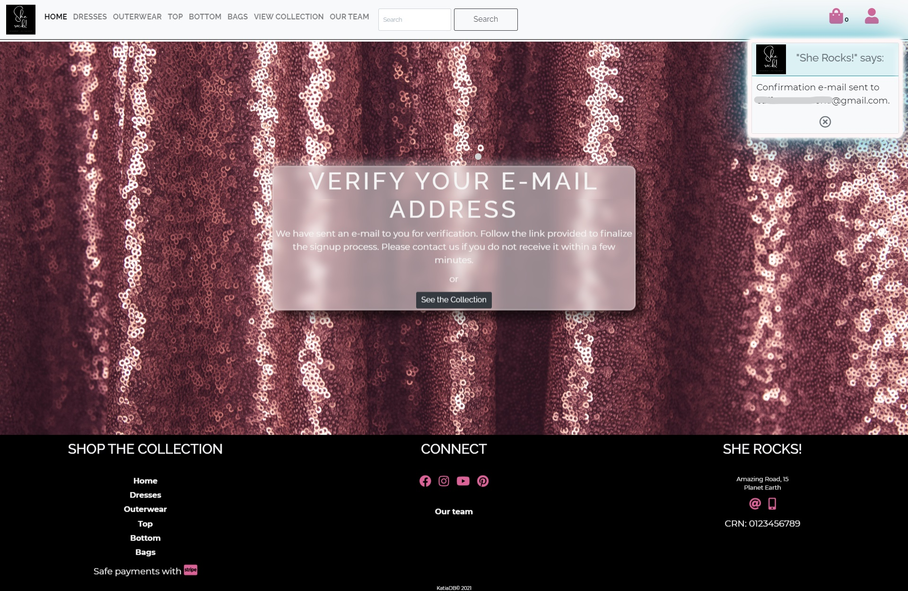

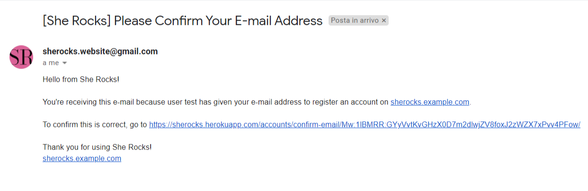

* I want to add a review:

    As a registered user I can perform tasks that are not available to non registered ones. One of them is the chance to
     add a review.
    From any page I can simply click on the profile icon. A dropdown menu with sub-links opens and I can select "My profile".
    From this page, I can click on the section "My reviews" which is inside "My activity".
    If I have already added reviews, I can find them here.
    There is a button which says "Add review". I click on it and I am redirected to a page with a two fields form.
    I can select from the dropdown menu the name of the product that I want to review, and in the text area below I can 
    add my opinion on that product. I can save it by submitting the form. I am redirected to the collection page and 
    a toast confirms that my review has been correctly added.

* I want to log out:

    I click on the user icon and I select the option "logout". I need to confirm if I really want to sign out, and if I 
    click on the "sign out" button I am redirected to the home page, with a toast that confirms that now I signed out.

#### As an admin

* I want to add a product directly from the website:

    I log in with my credentials. Being an admin I can access functionality that is not accessible to other users.

    I can click on the user icon, select "Product Management" and I am redirected to a page where I can add a new product 
    to the database. I click on "Add Product" and if the form is valid the product is successfully added. If not,
     a message inside the forms tells me what is wrong.

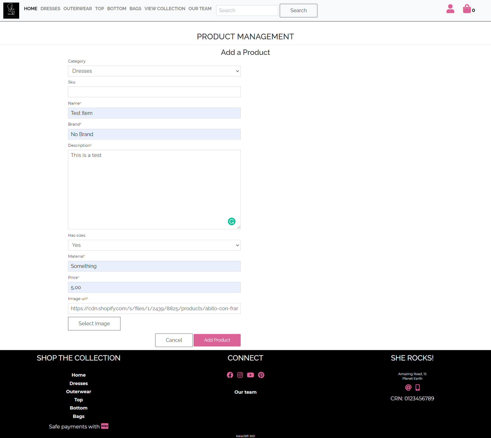

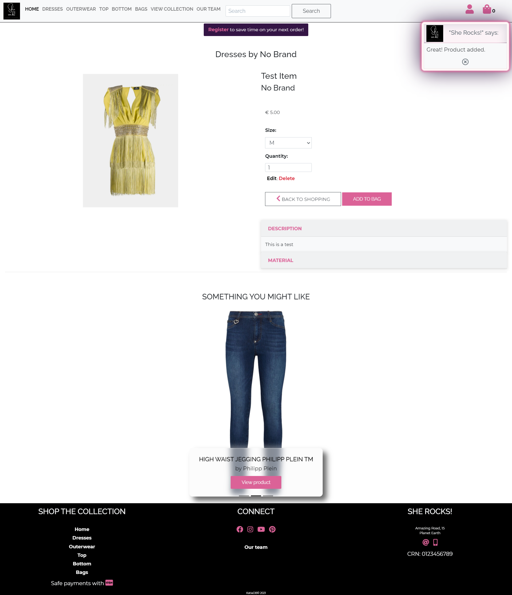

* I want to update details about a product from the website:

    I log in with my credentials. Being an admin I can access functionality that is not accessible to other users.

    On every page where an item is displayed, I see two options: "edit" or "delete".

    If I want to update some info, I click on detail and I can now access a form. Inside each field I can see the 
    product details that are already in the database. I click on the field that I want to update, change the value, and then 
    click on the button "Update Product". If everything is correct, the form is validated and submitted.

    I see a toast with a confirmation message and I am redirected to the collection page.

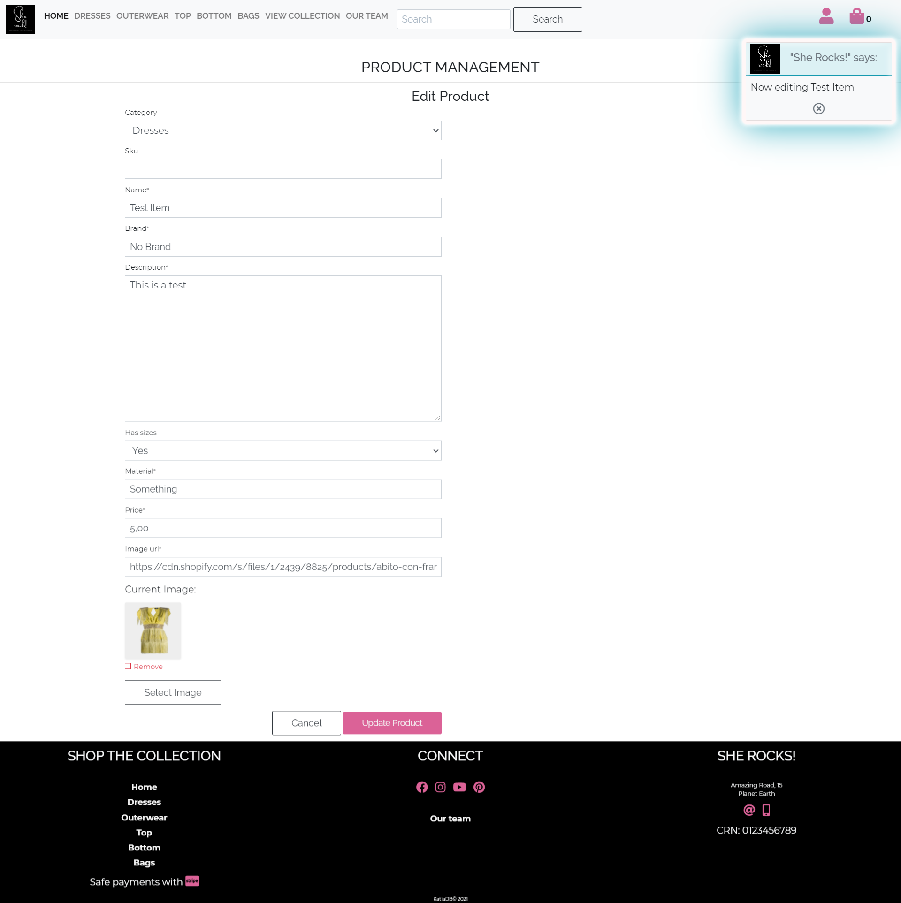

* I want to delete a product from the website:

    I log in with my credentials. Being an admin I can access functionality that is not accessible to other users.

    On every page where an item is displayed, I see two options: "edit" or "delete".

    I select "delete" and the item is automatically removed from the database. I am redirected to the collection
     page and I get a toast confirmation.

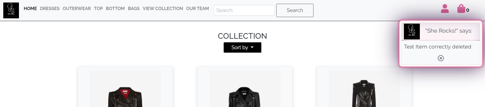

</details>

<details>

<summary>Compatibility Testing </summary>

### Compatibility Testing

The website has been tested on laptop and mobile phone.

Browsers:

* Chrome: no issues.

* Edge: no issues.

* Firefox: a few issues. Check the "bug" section.

* Safari (on iPhone): issue with background attachment set to fixed. Check "bug" section for more details.

* Opera: no issues.

</details>

<details>

<summary>Performance Testing </summary>

### Performance Testing

To check performance testing I used Google Test Mobile Friendly, Google Lighthouse and Google PageSpeed Insights for the home page and all-artists page.

The biggest issue is in the loading of the pages due to images that are too big.

It was already in my plan to resize all the images, since I already knew images were a problem, but after the performance testing

I realized that this will be the first thing I am going to do after the first release.

I will also add pagination.

I will set the priority to improve performance.

Those are the results:

* Google Test Mobile Friendly


* Lighthouse Mobile

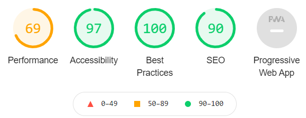

* Lighthouse Desktop

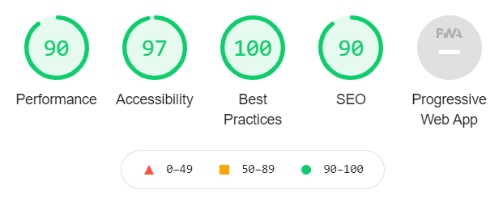

* Speed Insights Mobile

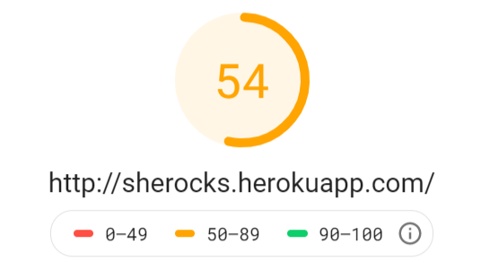

* Speed Insights Desktop

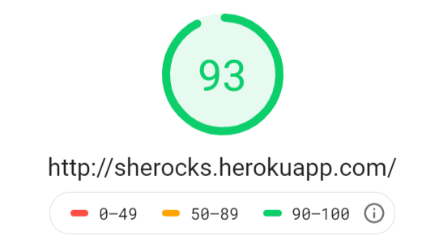

</details>


### Bugs

#### Solved Bugs:

##### iOS

I had a problem with the home page on iOS, since the third section has a background attachment property set to fixed.
That gives a parallax effect, but is not supported on iOS.
The design was compromised, so I wrote some JavaScript to detect if the device is iOS, and if that returns true, 
the fixed property is removed from the section.

The parallax effect on this section is lost, but at least the background image is visible even if it scrolls with the page.

I could have also used the same parallax effect that has the first section in the home page, which is working properly also on iOS,
but the visual effect is slightly different and I didn't want to replicate the exact same result.

##### Firefox

On Firefox the property "backdrop-filter: blur" that gives the glassmorphism effect is not supported. 

This is acceptable over the carousel, but it makes very hard to read the words in the register/sign in form.

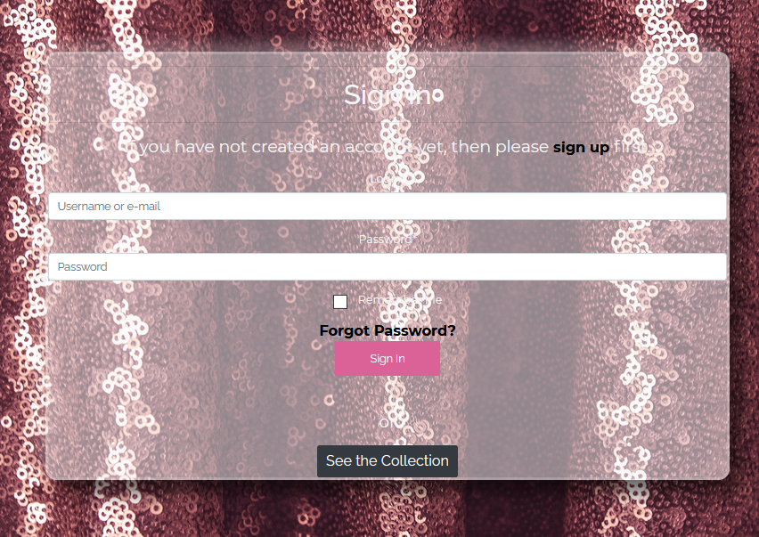

I decided to write some JavaScript to fix this bug (static/js/firefox-backgorund.js) which detects if the browser is Firefox;
if so, it will apply a dark shade of purple instead of the white blurred background. 

I used [Image Color Picker](https://imagecolorpicker.com/) to get the color value for the background by uploading the 
background image that I used for the main container. After I got all the color values related to that image, I chose the darker one
and I applied the value inside the code.

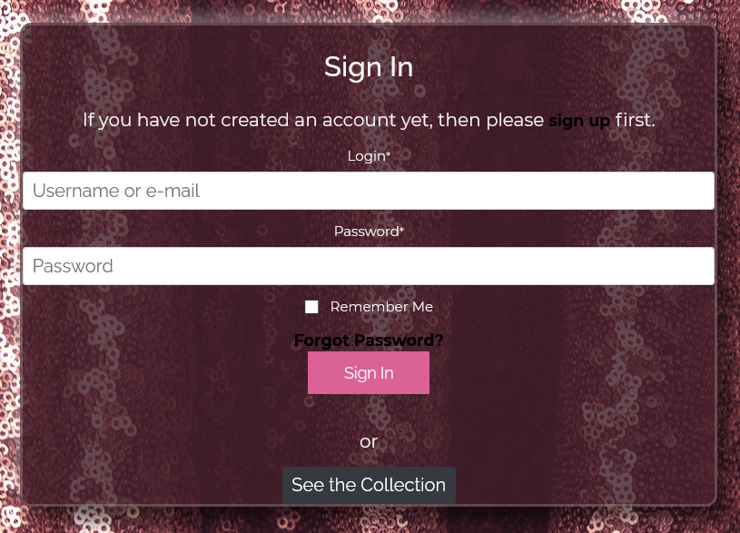

#### Known bugs 

##### On 280px screens:
 
 The home page floats horizontally because the navbar is wider than the viewport.
 The pages are not centered.

##### Error 500

It happened a couple of times that an error 500 appeared random while navigating. The error disappeared by itself by refreshing
after a few minutes.

It was not possible to understand what caused the issue because it happened randomly and only in a couple of occasions.

I testsed the website many times, on multiple devices, and I asked friends to test as well. No one had the issue with
the error 500.

---

---

## Deployment

The website has been deployed connecting Heroku with GitHub.

#### Fork the code on GitHub
If you need to work on this code on your own, follow these steps:

* Log in to GitHub;
* Find the repository you are looking for;
* On the top-right of the page you will find a button with the name "Fork";
* Click on it and it will automatically fork the code to your GitHub.


#### Local Clone
To make a local clone of the site, just follow these stepsg:

* Log in to your GitHub;
* Under your repository section, select the repo that you need;
* You will find a green button with the name "Code". Click on it;
* On the dropdown selection, you will find a link to clone the code with HHTPS;
* Now open Git bash;
* Open the directory where you want to work on the cloned code;
* Type git clone followed by the link you have previously copied.

* Create a file env.py and a file .gitignore.
* Add env.py to .gitignore.
* Set environment variables (you can choose if you want to set them in env.py or in GitPod settings - if you are using GitPod).
    ```
    import os

    os.environ.setdefault('SECRET_KEY', '<your-value>')
    os.environ.setdefault('DEVELOPMENT', '1')
    os.environ.setdefault('ALLOWED_HOSTS', '<your-value>')
    os.environ.setdefault('STRIPE_PUBLIC_KEY', '<your-value>')
    os.environ.setdefault('STRIPE_SECRET_KEY', '<your-value>')
    os.environ.setdefault('STRIPE_WH_SECRET_CH', '<your-value>')
    os.environ.setdefault('STRIPE_WH_SECRET_SUB', '<your-value>')
    os.environ.setdefault('SECRET_KEY', '<your-value>')
    ```

* install requirements from requirements.text
    ```pip3 install -r requirements.txt ```

* to run the server type in the terminal
    ```python3 manage.py runserver```

### Deploy to Heroku 

Make sure to have those files in your project:

* requirements.txt (type ```pip3 freeze > requirements.txt``` )

* Procfile (inside type ```web: gunicorn your-app.wsgi:application```)

Now go to Heroku, create an account if you don't have one, create a new app.

* Select "Postgres" from resources

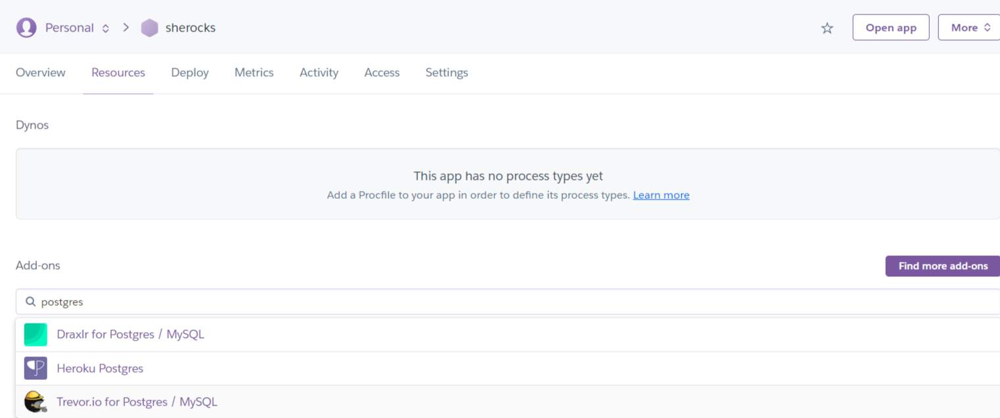

* in settings.py comment out "DATABASES"

* import dj_database_url

* type in DATABASES 
    ```'default': dj_database_url.parse("<your-postgres-url>")```

* migrate the models
    ```python3 manage.py makemigrations
        python3 manage.py migrate
    ```

* migrate models to Postgres
    ```python3 manage.py migrate```

* load data to Postgres
    ```python3 manage.py loaddata db.json```

* create a superuser
    ```python3 manage.py createsuperuser```

* go back to settings.py, comment out 'default': dj_database_url.parse("<your-postgres-url>")`
 and un-comment the section previously commented out.

* Commit and push to GitHub
    ``` 
    git add .
    git commit -m "Some text"
    git push
    ```

* Go to Heroku and add those environment variables:

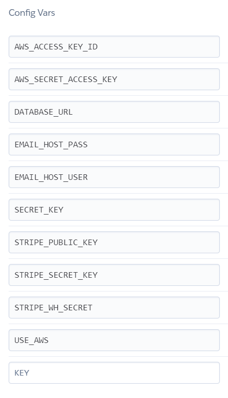

* Click on the tab "Deploy" and connect with GitHub

* Enable Automatic Deploy

* Deploy Branch

Create an account on AWS, and in [S3](https://docs.aws.amazon.com/AmazonS3/latest/userguide/GetStartedWithS3.html) open a bucket where you will store static/ files and media/ files.

On Aws,

* create a policy

* create a group

* create an access policy

* create a user

---

## Credits

### :star: Code

* [Boutique Ado from Code Institute](https://github.com/ckz8780/boutique_ado_v1) provided the base for the project.

* Parallax effect in home page from https://youtu.be/llv5kW4sz0U

* Neon effect adapted from https://redstapler.co/realistic-css-neon-text-effect-tutorial/ 

* Shadow effect adapted from https://css-tricks.com/simulating-drop-shadows-with-the-css-paint-api/ 

* Glassmorphism effect: code adapted and modified from https://glassmorphism.com/ 

* Styling hr in footer: code adapted from https://tonys.se/artiklar/ovrigt/css-hur-du-gor-snygga-hr-taggar/

* Source inspiration for neumorphism: https://css-tricks.com/neumorphism-and-css/

### :star: Media

All images sources are linked [here](static/readme-doc/Links.pdf).

### :star: Acknowledgements

Thank you to my mentor Spencer Barriball for his precious help.

A special thanks also to the Code Institute Tutor Team, that has been always very nice helping with some issues that I faced
 during the development.


